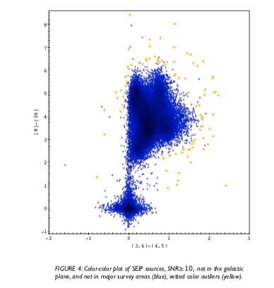
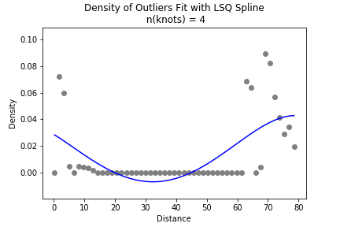
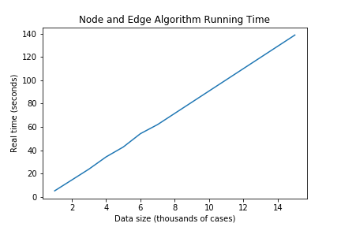

% Identifying Notable Objects from Spitzer Enhanced Imaging Astronomical Observations
% IBhojwani, AlexanderTyan, Sun-Kev, tamos
% May 2018

------------------

\begin{align*}
Goals, Approach, Hypotheses
\end{align*}

_Goals_

i) Identify notable objects (outliers)
ii) Locate notable objects within the sky
iii) Define an area of interest around that object

_Approach_

Excess infrared light could mean: 

i) Young Stellar Objects
ii) Active Galactic Nucleii
iii) Colliding Galaxies
   
_Hypotheses_

i) Notable objects can be identified as extrema in terms of infrared light
ii) Some notable objects are grouped into interesting structures

------------------

### Data

NASA/IPAC Infrared Science Archive

Wide-field Infrared Survey Explorer (WISE) - a map of the whole sky

Identifies objects, and readings on the energies they emit

Approx. 800m objects (records),  815 GB

Contains: location (x, y), movement, colour, readings across a number of bands

----------------------

### Unexpected Colour -> interesting object 

---------------------

### Preprocessing with K-Means Classification

Canned K-Means in Spark

Split points into two groups, ~ N w/in themselves

W/in each group, take outliers, $x_i$: $x_i \geq \mu \pm 2\sigma$

------------------

### Algorithm 1: Outliers as Nodes, Distances as Edges  

Developed algorithm with parameters N, P, K.

Complexity:

If number of cases < N(P): Does not run

Otherwise, approximately:
$$\left( \sum_{i=1} ^{N - N \times P} (N \times P) + i \right)  \times \frac{size - (N \times P)}{ N \times P} $$

Compare to:
$$ size^2 $$

------------------

### Algorithm 1 Details

------------------

### Algorithm 2: Split Sky, Random Walk, Watershed

-----------------

### Algorithm 2: Part I: Split Sky

Create grids of the entire sky

Create graphs of each grid

-----------------

### Algorithm 2: Part II: Random Walk

Random walks on graph to produce gradient

-----------------

### Algorithm 2: Part III: Watershed

Watershed algorithm to define dividing lines on gradient

-----------------

### Approaches and Tools

- Spark (clustering)

- MapReduce (mrjob)

------------------

### Runtime examples

look how slow it would be without parallelism

look how fast it would be

------------------

### Challenges

Problem: Graph algorithms without all data in memory; complexity too great for a fully connected graph

Solution: Running random sample (Algorithm 1)

Problem: Entire sky too large for Algorithm 2

Solution: Grids and streaming processing

------------------

### Results

Many important results

------------------

Appendices and Extras

------------------

### Algorithm 1 Implementation

i) initialize a node list (Map 1)

ii) for each object: (Map 1)

    - add the object to our node list

    - if the node list is too large:
       remove nodes at random until the list is size N(P):

iii) if the node list is sufficently full (size N(P))

      - yield the object's id and distance to each node

iv) for each object (Reduce 1)

    - take K edges (the closest K)

---------------------

### Algorithm 1 Implementation (Cont'd)

v) for each object (Map 2)

    - create a density function of distances from
    the object

    - fit a spline function along this density curve

    - find the first saddle point in this spline, usually
    a local minimum

    - if the first saddle point is less than 1
    return the object and its saddle point

Interpret the saddle point as the outer boundary of objects
of interest in the vicinity of this point. 

------------------

### Algorithm 1 Runtime

----------------------

### Algorithm 2 Implementation

Grids:

r x c grids -> bite-sized chunks

Output key: grid id

------------------

### Algorithm 2 Implementation (Cont'd)

Graphs and Random Walks:

Fully connected graphs w/ distance$^{-1}$ as edge weight

Random walks on graph -> gradient of re-visit frequency

------------------

### Algorithm 2 Implementation (Cont'd)

Watershed Algorithm:

Segmentation of the "image" - i.e, gradient

------------------

### Code

https://github.com/ibhojwani/seip_big_data

   
------------------

To do list:
- Big Data approaches used (e.g. "MapReduce"); brief description of how you got the algorithm working if it would be instructive to others (e.g. "we used key-value pairs that were names of people as the key and whether they were a visitor or a visitee as the value")
- if possible, cite extrapolated runtimes to demonstrate why running on a single machine would take prohibitively long
- any Big Data related tools or techniques you learned that we did not cover in lecture, similarly, anything else you think your fellow students would find interesting or good to know
- challenges
- the results you got

To compile run  pandoc -t beamer Presentation.txt -o Presentation.pdf -V theme:Pittsburgh

